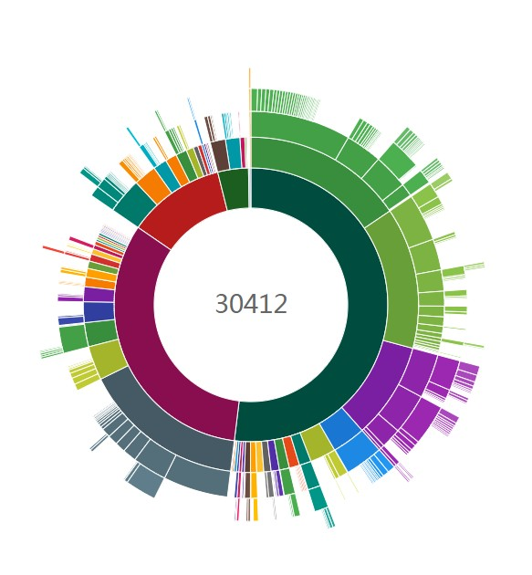
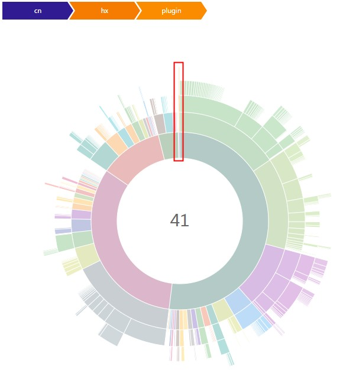
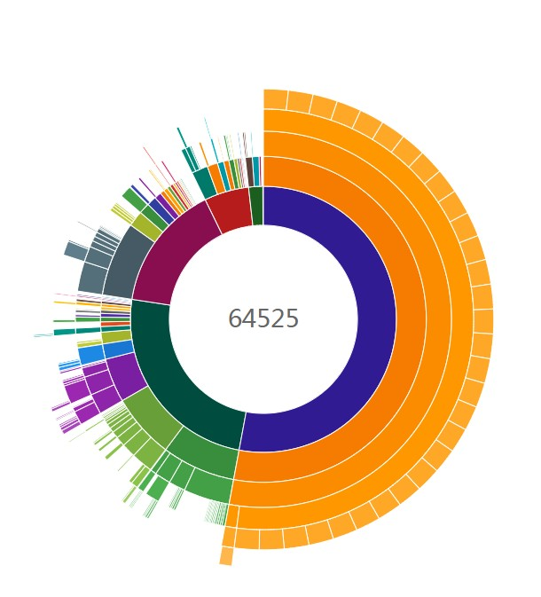
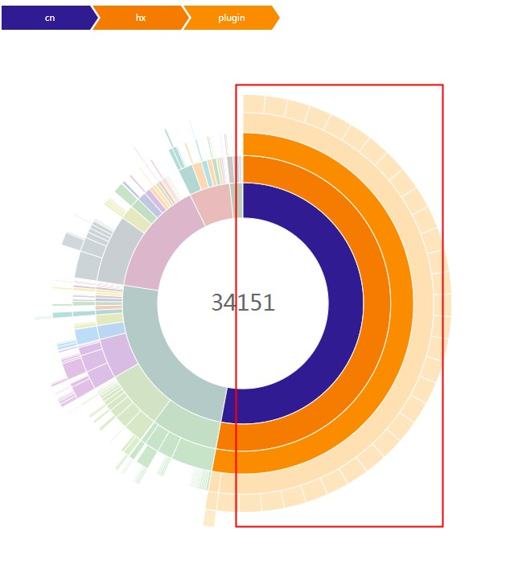

#  Android 代码加成插件

此插件用于android打包时，增加代码量以增加反编译工作量。

### 使用方法

根目录的build.gradle中：
```
buildscript {
    repositories {
        mavenCentral()
    }
    dependencies {
        classpath "com.woaizhuangbi:com.woaizhuangbi.minify-code:1.0.0"
    }
}
```


app目录的build.gradle模块中：

```groovy
androidJunkCode {
    def config = {
        packageBase = "www.demo.com"    //生成java类根包名
        packageCount = 30               //生成包数量
        activityCountPerPackage = 3     //每个包下生成Activity类最大数量，数量将取中间值随机
        excludeActivityJavaFile = false //是否排除生成Activity的Java文件,默认false(layout和写入AndroidManifest.xml还会执行)，主要用于处理类似神策全埋点编译过慢问题
        otherCountPerPackage = 50       //每个包下生成其它类的最大数量，数量将取中间值随机
        methodCountPerClass = 20        //每个类下生成方法最大数量，数量将取中间值随机
        resPrefix = "m_"                //生成的layout、drawable、string等资源名前缀
        drawableCount = 300             //生成drawable资源数量
        stringCount = 300               //生成string数量
    }
    variantConfig {
        debug config
        release config
    }
}
```

如果APP开启了混淆，需要在混淆文件里配置

```
# com.demo.www为前面配置的packageBase
-keep class com.demo.www.** {*;}
```

### 生成文件所在目录
build/generated/source/junk

### 使用插件[methodCount](https://github.com/KeepSafe/dexcount-gradle-plugin)对比

#### 未加垃圾代码

**项目代码占比 0.13%**




#### 加了垃圾代码

**项目代码占比 52.93%**

